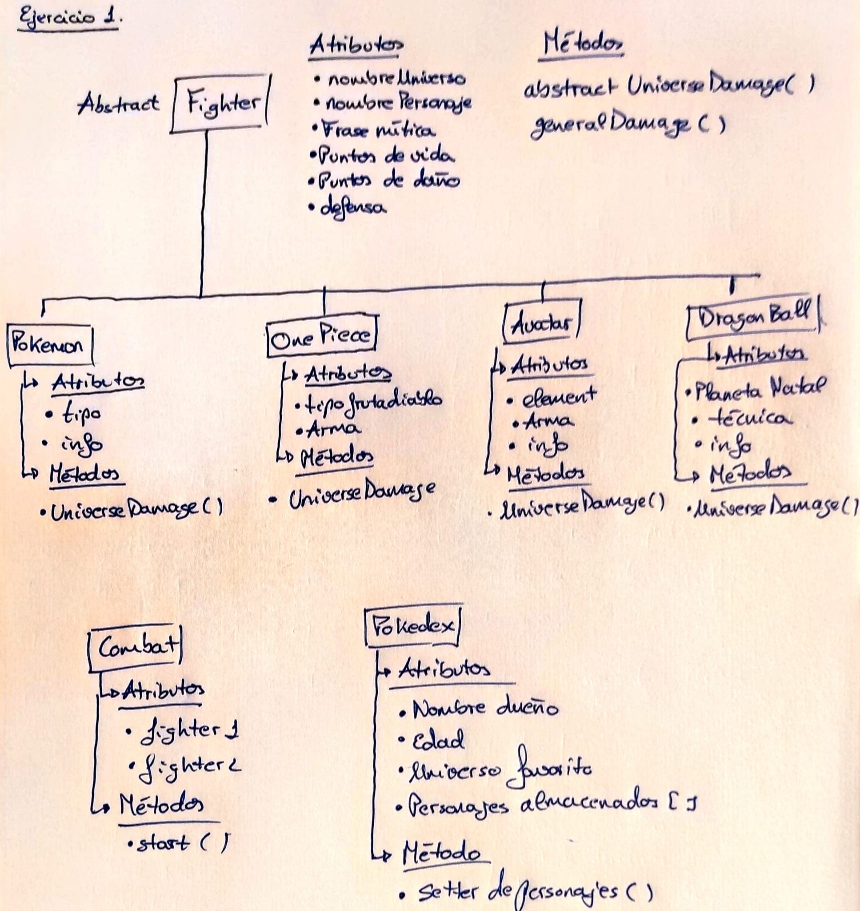

# Practica 6: Clases e interfaces genéricas. Principios SOLID
## Autor: Vlatko Jesús Marchán Sekulic.

---
El repositorio se encuentra en seguimiento por coveralls.

[](https://coveralls.io/github/ULL-ESIT-INF-DSI-2122/ull-esit-inf-dsi-21-22-prct06-generics-solid-alu0101321141.github.io?branch=main)

---

### Ejercicio 1. El combate definitivo.

Para la realización del ejercicio se ha diseñado la siguiente jerarquía de clases con los atributos y métodos:



La logica seguida para esta estructura de clases es la siguiente. 

1. La clase Figther tiene que ser la más alta dentro de la jerarquía dentro de los unviersos para tomar los atributos comunes para realizar peleas entre los personajes.
    * Dentro de esta clase abstracta se definen dos métodos:
      * UniverseDamage() que se encargará de calcular el daño que se realizan los personajes de un mismo universo, siguiendo sus reglas propias.
      * generalDamage() que se encargará de calcular el daño entre universos diferentes. Para ello tomamos la siguiente lógica, los universos de OnePiece y de Dragon Ball se encuentran en escalas de poder igualados (Por ello los ataques entre los personajes de ese universo siempre serán efectivos). Y su ataque será un 10 % más fuertes. Por otro lado Avatar se encuentra en una escala de poder promedia y por ello no recibe ninguna mejora en su ataque, y por ultimo el universo pokemon será el más debil de todos y su ataque será un 10% menos efectivo.
2. Las clases de cada universo. Estas clases que heredan de la clase abstracta se encargarán de recopilar la información particular de cada universo y controlar las reglas de lucha de personajes de su mismo universo.
    * El daño dentro del universo Pokemon se seguirán las reglas definidas en las prácticas anteriores.
    * El daño dentro del universo Avatar viene dado por los tipo de elementos que utiliza cada personaje y el arma que porta.
    * En daño dentro de la clase Dragon ball viene dado por la tecnica que utiliza cada personaje para luchar.
    * El unverso One Piece por su parte el daño se lo otorgan las furtas del diablo y el arma que porta
3. La clase Combate se encargará de pautar los turnos de cada personaje e ir calculando los daños realizados en cada turno.
4. Pokedex guardará la información de su propietario y los personajes que ha registrado en el.

Las pruebas implementadas en los universos son:

```typescript
describe("Pruebas de la clase Pokemon", () => {
    const pikachu = new Pokemon("Pokemon", "Pikachu", "Pika Pika CHUU", 45, 80, 50, "Electric", [430, 75, 60, 120]);
    const vaporeon = new Pokemon("Pokemon", "Vaporeon", "vapo vapo vaporeon", 130, 65, 60, "Water", [525, 110, 95, 65]);
    const dragonite = new Pokemon("Pokemon", "Dragonite", "Dragoonite", 91, 134, 95, "Fire", [600, 100, 100, 80]);
    const bellossom = new Pokemon("Pokemon", "Bellossom", "Bello Bello Bellossom", 75, 80, 95, "Grass", [490, 90, 100, 50]);
    it("Pruebas de la definición de la clase Pokemon", () => {
      expect(pikachu).not.to.be.null;
    });
    it("Getters del universo pokemon ", () => {
      expect(vaporeon.getNameUniverse()).to.eq("Pokemon");
      expect(pikachu.getNameCharacter()).to.eq("Pikachu");
      expect(dragonite.getCatchingPhrase()).to.eq("Dragoonite");
      expect(bellossom.getHP()).to.eq(75);
      expect(bellossom.getDM()).to.eq(80);
      expect(bellossom.getDefense()).to.eq(95);
      expect(bellossom.getType()).to.eq("Grass");
      expect(bellossom.getInfo()).to.eql([490, 90, 100, 50]);
    });
    it("Setter del universo Pokemon ", () => {
      bellossom.setHP(10);
      expect(bellossom.getHP()).to.eq(10);
      bellossom.setHP(75);
      bellossom.setHP(-10);
      expect(bellossom.getHP()).to.eq(0);
      bellossom.setHP(75);
      bellossom.setDefense(10);
      expect(bellossom.getDefense()).to.eq(10);
      bellossom.setDefense(80);
      bellossom.setDefense(-10);
      expect(bellossom.getDefense()).to.eq(0);
      bellossom.setDefense(80);
    });
  });

  describe("Pruebas de la clase Avatar", () => {
    const aang = new Avatar("Avatar", "Aang", "La venganza es como un arma de doble filo: mientras " +
      " ves caer a tu enemigo, te envenenas por dentro", 250, 150, 100, "Avatar", "Planeador", [12, "Nomadas del aire"]);
    const zuko = new Avatar("Avatar", "Zuko", "Yo solía pensar que esta cicatriz me marcaba. La marca " +
      "del príncipe desterrado, condenado a perseguir al Avatar para siempre.", 150, 100, 80, "Fire", "Espadas duales Dao", [18,
      "Nación del fuego"]);
    const katara = new Avatar("Avatar", "Katara", "No! Yo nunca ¡Jamás! le daré la espalda a alguien que me necesite.",
        100, 80, 40, "Water", "hielo", [14, "Tibu Agua del norte"]);
    const Toph = new Avatar("Avatar", "Toph Beifong", "No me importa cómo me veo. No busco la aprobación de nadie." +
      " Sé muy bien quien soy.", 150, 95, 100, "Land", "Cables Metal", [12, "Reino Tierra"]);


    it("Pruebas de la definición de la clase Avatar", () => {
      expect(aang).not.to.be.null;
    });
    it("Getters del universo Avatar ", () => {
      expect(zuko.getNameUniverse()).to.eq("Avatar");
      expect(katara.getNameCharacter()).to.eq("Katara");
      expect(Toph.getCatchingPhrase()).to.eq("No me importa cómo me veo. No busco la aprobación de nadie." +
      " Sé muy bien quien soy.");
      expect(Toph.getHP()).to.eq(150);
      expect(Toph.getDM()).to.eq(95);
      expect(Toph.getDefense()).to.eq(100);
      expect(Toph.getElement()).to.eq("Land");
      expect(Toph.getWeapon()).to.eq("Cables Metal");
      expect(Toph.getInfo()).to.eql([12, "Reino Tierra"]);
    });
    it("Setter del universo Avatar ", () => {
      Toph.setHP(10);
      expect(Toph.getHP()).to.eq(10);
      Toph.setHP(150);
      Toph.setDefense(10);
      expect(Toph.getDefense()).to.eq(10);
      Toph.setDefense(100);
      Toph.setWeapon("Espada");
      expect(Toph.getWeapon()).to.eq("Espada");
      Toph.setWeapon("Cables Metal");
    });
  });

  describe("Pruebas de la clase One Piece", () => {
    const luffy = new OnePiece("OnePiece", "Luffy", "En un duelo entre piratas… No existe tal cosa de jugar sucio",
        350, 400, 150, "Paramecia", "Gear 2", [19, "East Blue", "1.500.000.000 Belly"]);
    const akainu = new OnePiece("OnePiece", "Akainu", "¡¡El «mal» que representan los piratas debe ser erradicado!!",
        650, 1000, 300, "Logia", "", [55, "North Blue", "Almirante de flota"]);
    const Queen = new OnePiece("OnePiece", "Queen la Plaga", "¡Gracias por esperar! ¡Pedazos de basura!",
        400, 500, 250, "Zoan", "", [56, "Grand Line", "1.320.000.000 Belly"]);

    it("Pruebas de la definición de la clase OnePiece", () => {
      expect(luffy).not.to.be.null;
    });
    it("Getters del universo One Piece ", () => {
      expect(akainu.getNameUniverse()).to.eq("OnePiece");
      expect(Queen.getNameCharacter()).to.eq("Queen la Plaga");
      expect(Queen.getCatchingPhrase()).to.eq("¡Gracias por esperar! ¡Pedazos de basura!");
      expect(akainu.getHP()).to.eq(650);
      expect(akainu.getDM()).to.eq(1000);
      expect(akainu.getDefense()).to.eq(300);
      expect(akainu.getTypeDevilFruit()).to.eq("Logia");
      expect(akainu.getWeapon()).to.eq("");
      expect(luffy.getInfo()).to.eql([19, "East Blue", "1.500.000.000 Belly"]);
    });
    it("Setter del universo One Piece ", () => {
      luffy.setHP(10);
      expect(luffy.getHP()).to.eq(10);
      luffy.setHP(350);
      luffy.setDefense(10);
      expect(luffy.getDefense()).to.eq(10);
      luffy.setDefense(150);
      luffy.setWeapon("Espada");
      expect(luffy.getWeapon()).to.eq("Espada");
      luffy.setWeapon("Gear 2");
    });
  });

  describe("Pruebas de la clase DragonBall", () => {
    const goku = new DragonBall("DragonBall", "Goku", "kame kame ahhhhh!!!",
        400, 400, 450, "Vegeta", "Super Saiyan 2", [42, "Maestro Roshi"]);
    const vegeta = new DragonBall("DragonBall", "Vegeta", "maldito seas kakaroto",
        300, 350, 350, "Vegeta", "Super Saiyan 1", [42, "Exsoldado de Freezer"]);
    const krilin = new DragonBall("DragonBall", "Krilin", "Taiooookeeenn",
        200, 150, 150, "Tierra", "Kaioken", [43, "Maestro Roshi"]);

    it("Pruebas de la definición de la clase Dragon Ball", () => {
      expect(goku).not.to.be.null;
    });
    it("Getters del universo One Piece ", () => {
      expect(goku.getNameUniverse()).to.eq("DragonBall");
      expect(vegeta.getNameCharacter()).to.eq("Vegeta");
      expect(vegeta.getCatchingPhrase()).to.eq("maldito seas kakaroto");
      expect(vegeta.getHP()).to.eq(300);
      expect(vegeta.getDM()).to.eq(350);
      expect(vegeta.getDefense()).to.eq(350);
      expect(krilin.getPlanet()).to.eq("Tierra");
      expect(vegeta.getTechnics()).to.eq("Super Saiyan 1");
      expect(goku.getInfo()).to.eql([42, "Maestro Roshi"]);
    });
    it("Setter del universo Dragon Ball ", () => {
      goku.setHP(10);
      expect(goku.getHP()).to.eq(10);
      goku.setHP(400);
      goku.setDefense(10);
      expect(goku.getDefense()).to.eq(10);
      goku.setDefense(450);
      goku.setTechnics("Super Sayan Dios");
      expect(goku.getTechnics()).to.eq("Super Sayan Dios");
    });
  });
```

Con todas estas pruebas nos aseguramos el correcto funcionamiento de todos los universos. Por otro lado encontramos las diferentes implementaciones. (Todas ellas siguiendo las explicaciones anterior mente dichas).

* Figther

```typescript
export abstract class Fighter {

  constructor(private nameUniverse:string, private nameCharacter:string, private catchingPhrase:string,
    private HP:number, private DM:number, private defense:number) {
  }

  getNameUniverse() {
    return this.nameUniverse;
  }

  getNameCharacter() {
    return this.nameCharacter;
  }

  getCatchingPhrase() {
    return this.catchingPhrase;
  }

  getHP() {
    return this.HP;
  }

  getDM() {
    return this.DM;
  }

  getDefense() {
    return this.defense;
  }

  setHP(newHP:number) {
    if (newHP > 0) {
      this.HP = newHP;
    } else {
      this.HP = 0;
    }
  }

  setDefense(newDefense:number) {
    if (newDefense > 0) {
      this.defense = newDefense;
    } else {
      this.defense = 0;
    }
  }

  abstract universeDamage(fighter1:Fighter, fighter2:Fighter):number;

  generalDamage(fighter1: Fighter, fighter2: Fighter) {
    if (fighter1.getNameUniverse() == fighter2.getNameUniverse()) {
      return fighter1.universeDamage(fighter1, fighter2);
    } else {
      let dm:number = 0;
      if (fighter1.getNameUniverse() == "OnePiece" || fighter1.getNameUniverse() == "DragonBall") {
        dm = fighter1.DM * 1.10;
        if (dm > fighter2.defense) {
          return dm;
        } else {
          console.log(`El luchador ${fighter2.getNameCharacter()} ha esquibado el ataque.`);
          fighter2.setDefense(fighter2.getDefense() * 0.2);
          console.log(`Por ello se ha cansado y su defensa se ha reducido a ${fighter2.getDefense()}`);
          return 0;
        }
      } else if (fighter1.getNameUniverse() == "Avatar") {
        dm = fighter1.DM * 1;
        if (dm > fighter2.getDefense()) {
          return dm;
        } else {
          console.log(`El luchador ${fighter2.getNameCharacter()} ha esquibado el ataque.`);
          fighter2.setDefense(fighter2.getDefense() * 0.2);
          console.log(`Por ello se ha cansado y su defensa se ha reducido a ${fighter2.getDefense()}`);
          return 0;
        }
      } else {
        dm = fighter1.DM * 0.9;
        if (dm > fighter2.getDefense()) {
          return dm;
        } else {
          console.log(`El ${fighter2.getDefense()} ha esquibado el ataque.`);
          fighter2.setDefense(fighter2.getDefense() * 0.2);
          console.log(`Por ello se ha cansado y su defensa se ha reducido a ${fighter2.getDefense()}`);
          return 0;
        }
      }
    }
  }
}
```

La clase tiene sus getters y setters y por otro lado se ve la implementyación del daño entre los universos.

* Pokemon

```typescript
export class Pokemon extends Fighter {

  constructor(nameUniverse:string, nameCharacter:string, catchingPhrase:string,
      HP:number, DM:number, defense:number, private type:string,
      private info:[number, number, number, number]) {
    super(nameUniverse, nameCharacter, catchingPhrase, HP, DM, defense);
  }

  getInfo() {
    return this.info;
  }

  getType() {
    return this.type;
  }

  universeDamage(fighter1:Pokemon, fighter2:Pokemon): number {
    let maxDmg = 0;
    const fire: string = "Fire";
    const water: string = "Water";
    const grass: string = "Grass";
    const electric: string = "Electric";
    if (((fighter1.getType() == fire) && (fighter2.getType() == grass)) ||
      ((fighter1.getType() == water) && (fighter2.getType() == fire)) ||
      ((fighter1.getType() == electric) && (fighter2.getType() == water)) ||
      ((fighter1.getType() == grass) && (fighter2.getType() == water))) {
      maxDmg = fighter1.getDM() * 2;
    } else if ((fighter1.getType() == fire) && (fighter2.getType() == electric) ||
      (fighter1.getType() == grass) && (fighter2.getType() == electric)) {
      maxDmg = fighter1.getDM();
    } else if ((fighter1.getType() == grass) && (fighter2.getType() == fire) ||
      ((fighter1.getType() == fire) && (fighter2.getType() == water)) ||
      ((fighter1.getType() == water) && (fighter2.getType() == electric)) ||
      ((fighter1.getType() == water) && (fighter2.getType() == grass)) ||
      ((fighter1.getType() == fighter2.getType()))) {
      maxDmg = fighter1.getDM() * 0.5;
    }
    if (maxDmg > fighter2.getDefense()) {
      return maxDmg;
    } else {
      console.log(`El ${fighter2.getNameCharacter()} ha esquibado el ataque.`);
      fighter2.setDefense(fighter2.getDefense() * 0.2);
      console.log(`Por ello se ha cansado y su defensa se ha reducido a ${fighter2.getDefense()}`);
      return 0;
    }
  }
}
```

La clase pokemon sigue las misma implementacion de la anterior practica en cuanto al daño

* Dragon Ball

```typescript
export class DragonBall extends Fighter {

  constructor(nameUniverse: string, nameCharacter: string, catchingPhrase: string,
      HP: number, DM: number, defense: number, private planet: string,
      private Technics: string, private info: (string | number)[]) {
    super(nameUniverse, nameCharacter, catchingPhrase, HP, DM, defense);
  }

  getPlanet() {
    return this.planet;
  }

  getTechnics() {
    return this.Technics;
  }

  getInfo() {
    return this.info;
  }

  setTechnics(newTechnic:string) {
    this.Technics = newTechnic;
  }

  universeDamage(fighter1:DragonBall, fighter2:DragonBall): number {
    let maxDmg = 0;
    const superSayan1:string = "Super Saiyan 1";
    const superSayan2: string = "Super Saiyan 2";
    const superSayanDios:string = "Super Saiyan Dios";
    const kaioken:string = "kaioken";
    if (fighter1.getTechnics() == superSayanDios) {
      return fighter1.getDM() * 8;
    } else if (fighter1.getTechnics() == superSayan1 || fighter1.getTechnics() == superSayan2) {
      maxDmg = fighter1.getDM() * 1.4;
    } else if (fighter1.getTechnics() == kaioken) {
      maxDmg = fighter1.getDM() * 1.15;
    }
    if (maxDmg > fighter2.getDefense() ) {
      return maxDmg;
    } else {
      console.log(`El ${fighter2.getNameCharacter()} ha esquibado el ataque.`);
      fighter2.setDefense(fighter2.getDefense() * 0.2);
      console.log(`Por ello se ha cansado y su defensa se ha reducido a ${fighter2.getDefense()}`);
      return 0;
    }
  }
}
```
Las tecnicas implementadas dentro de la pelea son las básicas. utilizando una lógica similar a la de pokemon

* Avatar

```typescript
export class Avatar extends Fighter {

  constructor(nameUniverse: string, nameCharacter: string, catchingPhrase: string,
      HP: number, DM: number, defense: number, private element:string,
      private weapon:string, private info:(string|number)[]) {
    super(nameUniverse, nameCharacter, catchingPhrase, HP, DM, defense);
  }

  getElement() {
    return this.element;
  }

  getWeapon() {
    return this.weapon;
  }

  getInfo() {
    return this.info;
  }

  setWeapon(newWeapon:string) {
    this.weapon = newWeapon;
  }

  universeDamage(fighter1:Avatar, fighter2:Avatar):number {
    let maxDmg = 0;
    const fire: string = "Fire";
    const water: string = "Water";
    const air: string = "Air";
    const land: string = "Land";
    const avatar:string = "Avatar";

    if (fighter1.getElement() == avatar) {
      maxDmg = fighter1.getDM() * 2.5;
    } else if (((fighter1.getElement() == fire) && (fighter2.getElement() == air)) ||
      (((fighter1.getElement() == land) && (fighter2.getElement() == fire)) ||
      ((fighter1.getElement() == water) && (fighter2.getElement() == fire)))) {
      maxDmg = fighter1.getDM() * 2;
      if (fighter1.getWeapon().length != 0) maxDmg = fighter1.getDM() * 2 + (25 * fighter1.getDM() * 0.10);
    } else if ((fighter1.getElement() == air) && (fighter2.getElement() == land) ||
      (fighter1.getElement() == water) && (fighter2.getElement() == land)) {
      maxDmg = fighter1.getDM();
      if (fighter1.getWeapon().length != 0) maxDmg = fighter1.getDM() + (25 * fighter1.getDM() * 0.10);
    } else if (((fighter1.getElement() == air) && (fighter2.getElement() == fire)) ||
      (((fighter1.getElement() == fire) && (fighter2.getElement() == land)) ||
      ((fighter1.getElement() == fire) && (fighter2.getElement() == water))) ||
      ((fighter1.getElement() == fighter2.getElement()))) {
      maxDmg = fighter1.getDM() * 0.85;
      if (fighter1.getWeapon().length != 0) maxDmg = fighter1.getDM() * 0.85 + (25 * fighter1.getDM() * 0.10);
    } else {
      maxDmg = fighter1.getDM() * 0.5;
      if (fighter1.getWeapon().length != 0) maxDmg = fighter1.getDM() * 0.5 + (25 * fighter1.getDM() * 0.10);
    }
    if (maxDmg > fighter2.getDefense()) {
      return maxDmg;
    } else {
      console.log(`El ${fighter2.getNameCharacter()} ha esquibado el ataque.`);
      fighter2.setDefense(fighter2.getDefense() * 0.2);
      console.log(`Por ello se ha cansado y su defensa se ha reducido a ${fighter2.getDefense()}`);
      return 0;
    }
  }
}

```

En avatar se sigue la misma linea de los anteriores pero le aumenta el daño la utilización de armas.

* One Piece

```typescript
export class OnePiece extends Fighter {

  constructor(nameUniverse: string, nameCharacter: string, catchingPhrase: string,
      HP: number, DM: number, defense: number, private TypeDevilFruit: string,
      private weapon: string, private info: (string | number)[]) {
    super(nameUniverse, nameCharacter, catchingPhrase, HP, DM, defense);
  }

  getTypeDevilFruit() {
    return this.TypeDevilFruit;
  }

  getWeapon() {
    return this.weapon;
  }

  getInfo() {
    return this.info;
  }

  setWeapon(newWeapon:string) {
    this.weapon = newWeapon;
  }

  universeDamage(fighter1:OnePiece, fighter2:OnePiece): number {
    let maxDmg = 0;
    const paramecia: string = "Paramecia";
    const logia: string = "Logia";
    const zoan: string = "Zoan";
    if (fighter1.getTypeDevilFruit() == logia) {
      maxDmg = fighter1.getDM() * 1.20;
      if (fighter1.getWeapon().length != 0) maxDmg = fighter1.getDM() + (25 * fighter1.getDM() * 0.10);
    } else if (fighter1.getTypeDevilFruit() == paramecia) {
      maxDmg = fighter1.getDM() * 1;
      if (fighter1.getWeapon().length != 0) maxDmg = fighter1.getDM() + (25 * fighter1.getDM() * 0.10);
    } else if (fighter1.getTypeDevilFruit() == zoan) {
      maxDmg = fighter1.getDM() * 0.9;
      if (fighter1.getWeapon().length != 0) maxDmg = fighter1.getDM() + (25 * fighter1.getDM() * 0.10);
    } else {
      maxDmg = fighter1.getDM();
      if (fighter1.getWeapon().length != 0) maxDmg = fighter1.getDM() + (25 * fighter1.getDM() * 0.10);
    }
    if (maxDmg > fighter2.getDefense()) {
      return maxDmg;
    } else {
      console.log(`El ${fighter2.getNameCharacter()} ha esquibado el ataque.`);
      fighter2.setDefense(fighter2.getDefense() * 0.2);
      console.log(`Por ello se ha cansado y su defensa se ha reducido a ${fighter2.getDefense()}`);
      return 0;
    }
  }
}
```
Al igual que en en la clase avatar dentro de las armas y tecnicas dentro de este universo dan un aumento de daño.


Ahora La clase Combat sigue la misma lógica que la implementada en la práctica anterior pero utilizando el método de _generalDamage()_ para obtener los daños y estadísticas. Por otro lado otra modificación es el uso de la frase mítica.

```typescript
export class Combat {

  constructor(private Fighter1:Fighter, private Fighter2:Fighter ) {
  }

  getFighter1() {
    return this.Fighter1;
  }

  getFighter2() {
    return this.Fighter2;
  }

  setFighter1(newFighter:Fighter) {
    this.Fighter1 = newFighter;
  }

  setFighter2(newFighter:Fighter) {
    this.Fighter2 = newFighter;
  }

  start() {
    console.log(`Comienza el gran combate entre ${this.Fighter1.getNameCharacter()}` +
      ` y ${this.Fighter2.getNameCharacter()}`);
    let turno: number = 1;
    let dmg: number = 0;
    while (this.Fighter1.getHP() > 0 && this.Fighter2.getHP() > 0) {
      if (turno % 2 != 0) {
        console.log(`Turno: ${turno}`);
        console.log(`El luchador ${this.Fighter1.getNameCharacter()} realiza su ataque`);
        console.log(`${this.Fighter1.getCatchingPhrase()}`);
        dmg = this.Fighter1.generalDamage(this.Fighter1, this.Fighter2);
        this.Fighter2.setHP(this.Fighter2.getHP() - dmg);
        console.log(`El luchador ${this.Fighter2.getNameCharacter()} recibe ${dmg} de daño`);
        console.log(`Estado tras el turno el luchador ${this.Fighter1.getNameCharacter()} tiene ` +
          `${this.Fighter1.getHP()} de vida y el luchador  ${this.Fighter2.getNameCharacter()} tiene ` +
          `${this.Fighter2.getHP() } de vida`);
      } else {
        console.log(`Turno: ${turno}`);
        console.log(`El luchador ${this.Fighter2.getNameCharacter()} realiza su ataque`);
        console.log(`${this.Fighter2.getCatchingPhrase()}`);
        dmg = this.Fighter2.generalDamage(this.Fighter2, this.Fighter1);
        this.Fighter1.setHP(this.Fighter1.getHP() - dmg);
        console.log(`El luchador ${this.Fighter1.getNameCharacter()} recibe ${dmg} de daño`);
        console.log(`Estado tras el turno el luchador ${this.Fighter2.getNameCharacter()} tiene ` +
          `${this.Fighter2.getHP()} de vida y el luchador ${this.Fighter1.getNameCharacter()} tiene ` +
          `${this.Fighter1.getHP()} de vida`);
      }
      turno += 1;
    }
    if (this.Fighter1.getHP() != 0) {
      return `El ganador del combate es ${this.Fighter1.getNameCharacter()}`;
    } else {
      return `El ganador del combate es ${this.Fighter2.getNameCharacter()}`;
    }
  }
}
```

Por otro lado también tenemos la pokedex explicada anteriormente.

```typescript
export class Pokedex {

  constructor(private readonly nameOwner:string, private age:number, private FavUniverse:string,
    private Characters:Fighter[]) {
  }

  getNameOwner() {
    return this.nameOwner;
  }

  getAge() {
    return this.age;
  }

  getFavUniverse() {
    return this.FavUniverse;
  }

  getCharacters() {
    return this.Characters;
  }

  setNewCharacters(newCharacter:Fighter) {
    this.Characters.push(newCharacter);
  }
}
```

---

### Ejercicio 2. DSIflix

